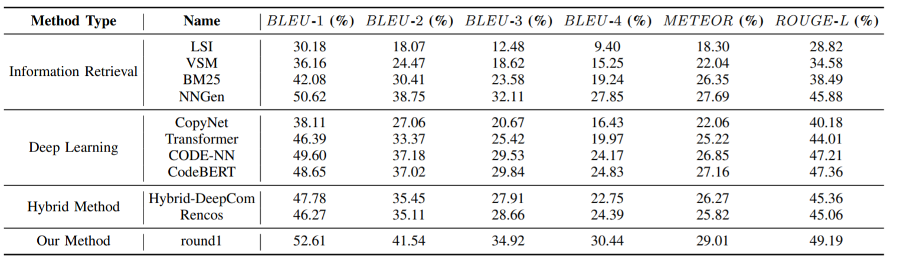
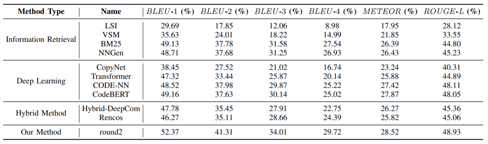
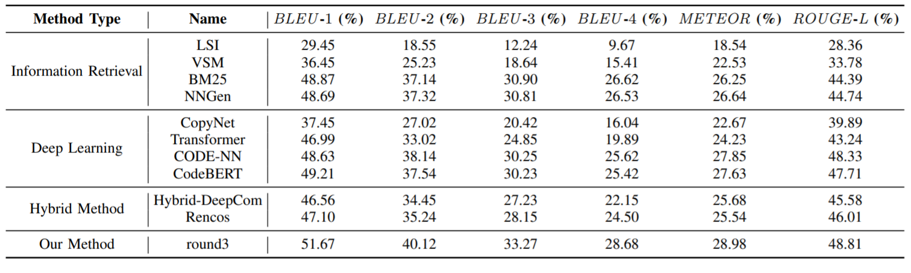
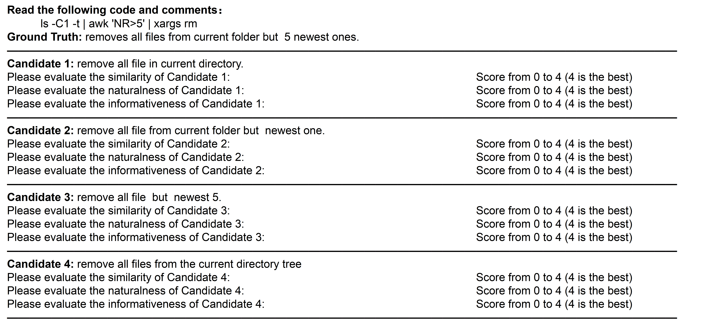

# Code For "BASHEXPLAINER: Retrieval-Augmented Bash Code Comment Generation based on Fine-tuned CodeBERT"

[[中文版](https://github.com/NTDXYG/BASHEXPLAINER/blob/main/README_zh.md)]

## Ⅰ DataSet

1. The raw data comes from the **NLC2CMD** competition and the **NL2BASH** paper open source data, which we have downloaded and placed under the **'data/raw_data'** folder.
2. For preprocessing the raw data and dividing the dataset, the code is stored in preprocess.py. *In particular, because we do not fix the random seed when using random.shuffle, it will cause the data obtained at each run to be inconsistent with the data we experimented with.*
3. Since our method involves two stages of training, the corresponding data are also stored under **'data/first_stage_data'** and **'data/second_stage_data'** respectively.
4. After running preprocess.py we get the data needed for the first stage of training, which is stored in **'data/first_stage_data'**.
5. After the retrieval enhancement by the retrieval module, the data obtained is the data we need for the second stage training, which is stored under **'data/second_stage_data'**. The use of the retrieval module is described below.

## Ⅱ First Stage Training

​        Open run.py in the **'first_stage_train'** directory, change the codebert_path to the local CodeBERT path, and run it directly. Save the bleu optimal model parameters and place them in **'pretrained_model/first_stage/pytorch_model.bin'**.

## Ⅲ Information Retrieval Module

1. Open the **'IR/bert_whitening.py'** file and modify the CodeBERT path corresponding to MODEL_NAME in line 7. Run it directly and you will get the code semantic repository needed to retrieve and the kernel and bias needed for the whitening operation.
2. Open the **'IR/IR_Module.py'** file and modify the type in the seventh line for retrieval. (For the training set, it needs to filter out itself)
3. The retrieved enhanced data is saved under **'data/second_stage_data'**.

## Ⅳ Second Stage Training

​		Open run.py in the **'second_stage_train'** directory, change the codebert_path to the local CodeBERT path, set the fix_encoder parameter to True, and run it directly.

## Ⅴ Don't want to train? Just use

​		We open source the model parameters of the second phase of the training and download them at: https://drive.google.com/file/d/1iv9PLVgj4iXmhW0EjCf9w5u-A2Zl2DxT/view

​		Download it and place it under the **'pretrained_model/second_stage'** path, then run **run.py** directly, which contains the code to generate the test set and the code example to generate a single bash comment.

## Ⅵ Comparison results (with the experimental results of different dataset split)

We randomly split our datasets three times with different random seeds. The detailed comparison result are shown as follows  and the comparison results confrm the effectiveness of our proposed method.

Comparison result with the first data split(recorded in the paper):

Comparison result with the second data split:

Comparison result with the third data split:

## Ⅶ A sample of  questionnaire used in our human study

