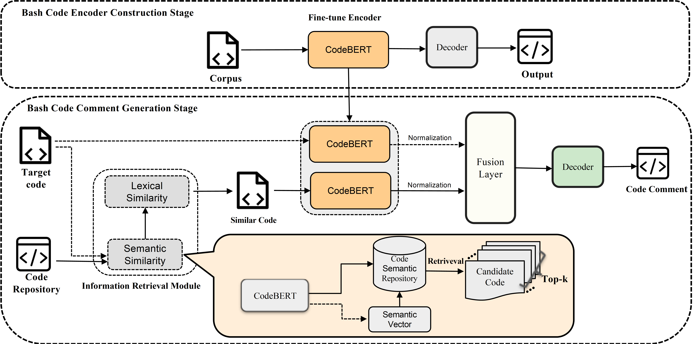
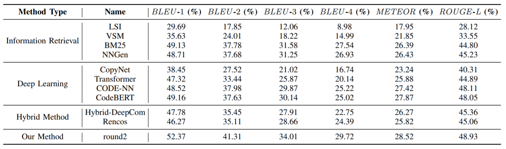
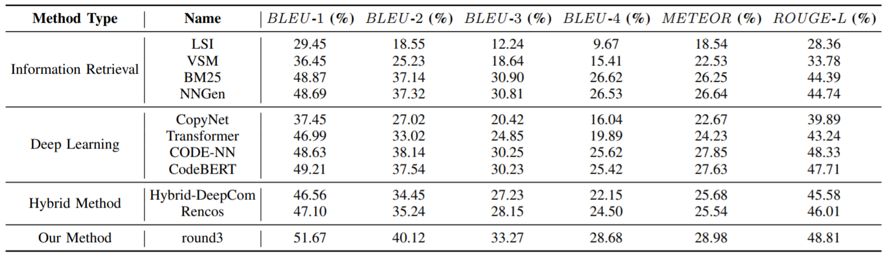
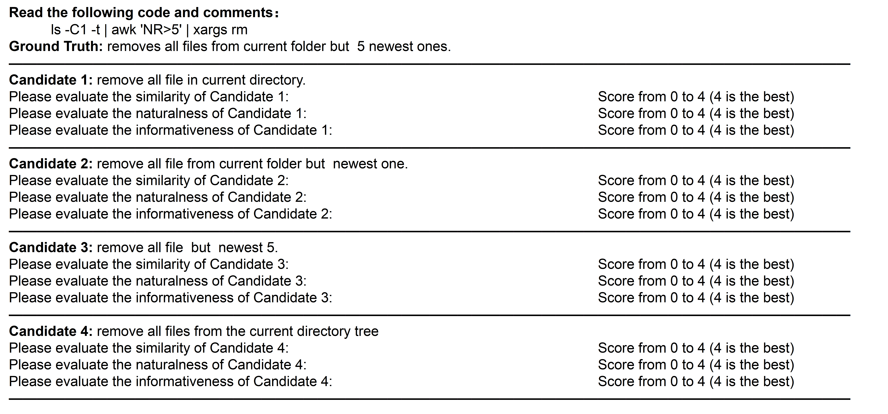

# Code For "BASHEXPLAINER: Retrieval-Augmented Bash Code Comment Generation based on Fine-tuned CodeBERT"

## Ⅰ 数据集

1. 原始数据来自与 **NLC2CMD** 竞赛 和 **NL2BASH** 论文开源数据，我们将其下载放置在 **'data/raw_data'** 文件夹下面。
2. 对于原始数据的预处理和数据集划分，代码存放在 preprocess.py 中。*特别强调，因为我们在使用 random.shuffle 时没有固定随机种子，会导致每次运行时得到的数据与我们实验的数据不一致。*
3. 因为我们的方法涉及两个阶段的训练，对应的数据也分别存放在 **'data/first_stage_data'** 和 **'data/second_stage_data'** 下面。
4. 运行 preprocess.py 后我们得到第一阶段训练所需要的数据，其存放在 **'data/first_stage_data'** 中。
5. 在进行检索模块进行检索增强后，得到的数据即是我们在第二阶段训练所需要的数据，其存放在 **'data/second_stage_data'** 下面。检索模块的使用方法在下文介绍。

## Ⅱ 第一阶段训练

​        打开 **'first_stage_train'** 目录下的run.py，将其中的codebert_path修改为本地的CodeBERT路径，然后直接运行。将bleu最优的模型参数进行保存，放置在 **'pretrained_model/first_stage/pytorch_model.bin'** 中。

## Ⅲ 信息检索模块

1. 打开 **'IR/bert_whitening.py'** 文件，修改第七行的MODEL_NAME对应的CodeBERT路径。直接运行，就会得到检索所需要的代码语义仓库和whitening操作所需要的kernel和bias。
2. 打开 **'IR/IR_Module.py'** 文件，修改第七行的type以进行检索。（对于训练集，需要过滤掉自身）
3. 检索增强得到的数据保存在 **'data/second_stage_data'** 下面。

## Ⅳ 第二阶段训练

​		打开 **'second_stage_train'** 目录下的run.py，将其中的codebert_path修改为本地的CodeBERT路径，将fix_encoder参数设置为True，然后直接运行。

## Ⅴ 不想训练？那就直接使用

​		我们将训练好的第二阶段的模型参数开源，下载地址：https://drive.google.com/file/d/1iv9PLVgj4iXmhW0EjCf9w5u-A2Zl2DxT/view

​		将其下载并放置在 **'pretrained_model/second_stage'** 路径下，然后直接运行 **run.py** ，里面包含了生成测试集的代码和生成单个bash注释的代码示例。

## Ⅵ 对比结果（加上了多次划分数据集的实验结果）

我们用不同的随机种子对我们的数据集进行了三次随机分割。详细的比较结果如下，比较结果证实了我们提出的方法的有效性。

第一次划分的结果（与论文中的结果一致）：

第二次划分的结果：

第三次划分的结果：

## Ⅶ 我们Human Study中使用的问卷样本

